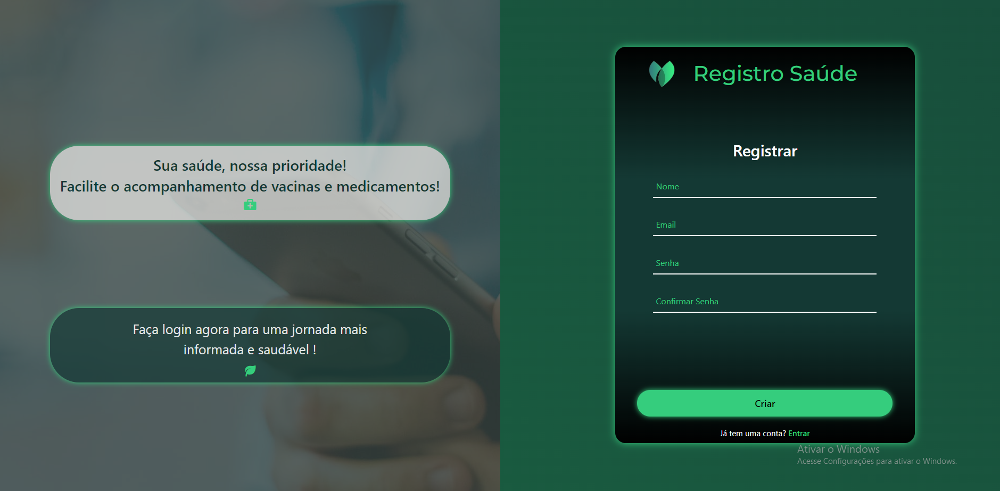
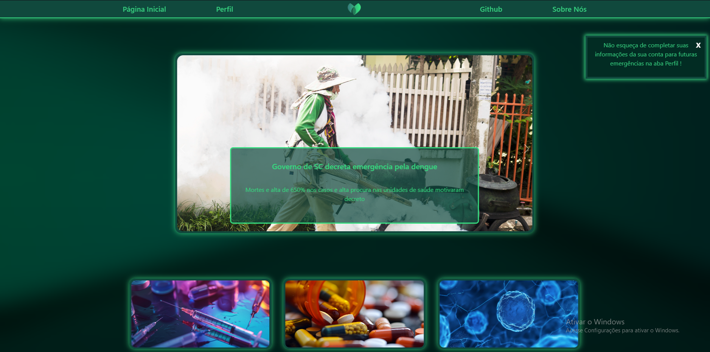
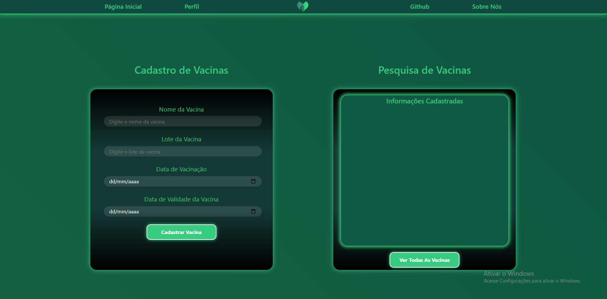
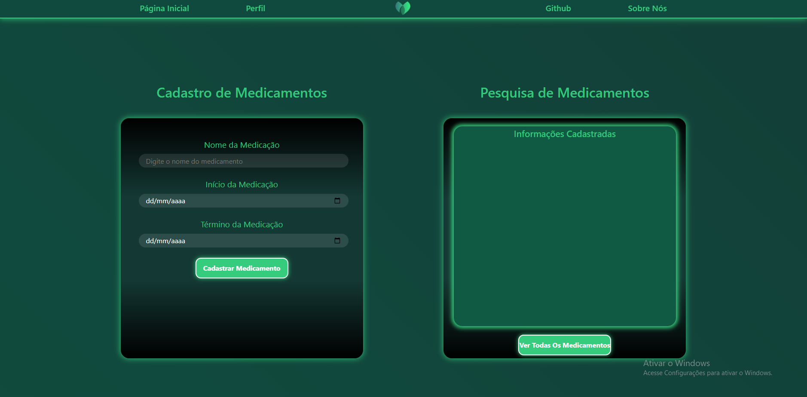
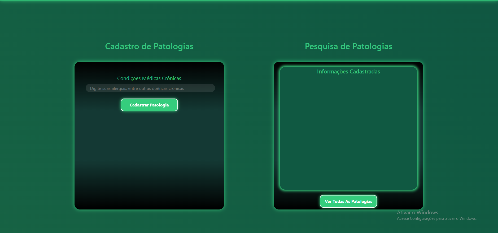
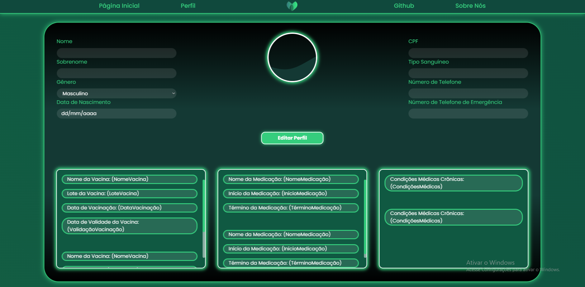
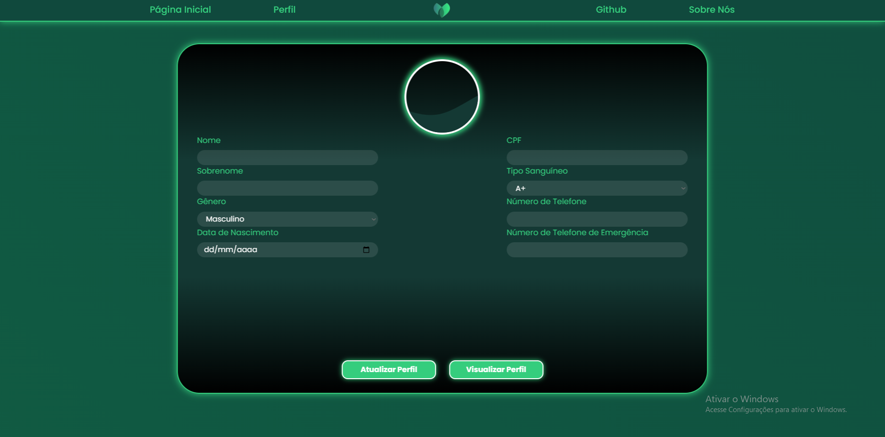

# 💉 Registro Saúde - Projeto Integrador Entra21/2023 💊

O projeto Registro Saúde visa criar uma plataforma de fácil acesso para os usuários, permitindo-lhes cadastrar todas as suas informações cruciais de saúde com facilidade. Isso inclui detalhes sobre vacinas, medicamentos e qualquer outra condição médica que possuam. Além disso, a plataforma permite acompanhar as datas de validade e prazos pertinentes a essas informações.

O principal objetivo deste projeto é fornecer uma solução prática e eficiente para situações de emergência, bem como para o dia a dia dos usuários, permitindo-lhes verificar suas informações de saúde sem a necessidade de carregar documentos físicos. Com a geração de um QR Code único no momento do cadastro do usuário, este pode ser escaneado para acessar instantaneamente o perfil do usuário e suas informações de saúde.

Além disso, o Registro Saúde oferece recursos adicionais, tais como:

- Lembretes: Mantém os usuários informados sobre datas de vacinação, renovação de receitas e outras informações relevantes.

- Registro detalhado: Além das informações básicas de saúde, os usuários podem incluir detalhes específicos sobre alergias, doenças médicas crônicas, e outros dados relevantes.

- Histórico completo: Armazena um registro completo e atualizado do histórico de saúde do usuário, facilitando o acompanhamento de mudanças ao longo do tempo.

Com todas essas funcionalidades, o Registro Saúde proporciona uma solução abrangente e personalizada para gerenciar e acessar informações de saúde de forma conveniente e segura.

# Nosso Objetivo

O projeto Registro Saúde visa simplificar o gerenciamento das informações de saúde dos usuários. Permitirá o registro e acompanhamento de vacinas, medicamentos e condições médicas, com suas respectivas datas de validade. O objetivo é garantir acesso fácil a essas informações em situações de emergência e no dia a dia, proporcionando uma solução prática e abrangente para o controle do histórico de saúde.

# Página Inicial

# Login
](Resources/Github2.png)

# Registro

# Home

# Cadastro Vacinas

# Cadastro Medicamentos

# Cadastro Patologias

# Perfil 

# Editar Perfil

# Linktree
